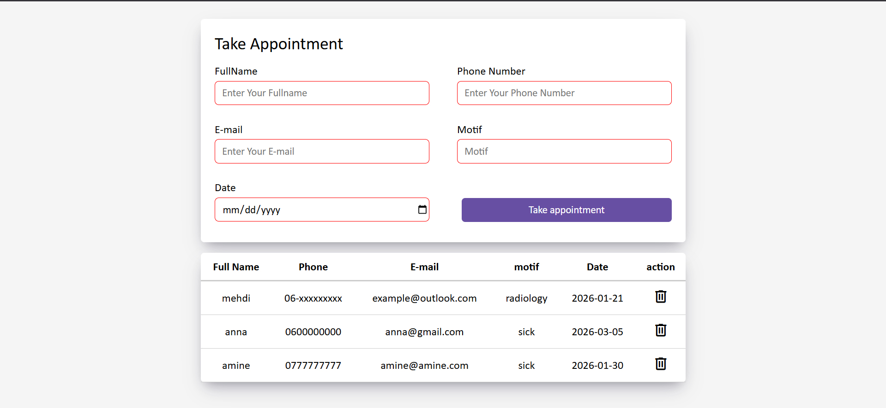

# 🏥 Appointment Management System (Vanilla JS)

A simple web-based appointment registration system that allows users to submit appointment details and manage them dynamically using **JavaScript** and **localStorage**.

## 📌 Project Overview

This project was built to practice **DOM manipulation**, **form validation**, and **localStorage** in JavaScript.  
Users can register appointments, view them in a table, and delete them without using any backend.

  

****

## ✨ Features

- Appointment registration form  
- Required field validation with error messages  
- Data persistence using `localStorage`  
- Dynamic rendering of appointments in a table  
- Delete appointments functionality  
- Success and error UI messages  

## 🛠️ Technologies Used

- HTML5  
- CSS3  
- JavaScript (Vanilla JS)  
- Browser LocalStorage  

## ⚙️ How It Works

1. User fills in the appointment form (name, phone, email, motif, date)  
2. Inputs are validated before submission  
3. Appointment data is stored in `localStorage`  
4. Appointments are displayed dynamically in a table  
5. User can delete any appointment instantly  

